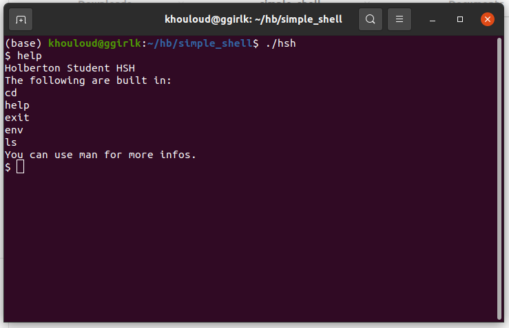

# [ Holberton School Simple Shell Project](https://www.holbertonschool.com/tn/en/pathways)



# 🧑🏻‍💻 Intro

Simple shell is a project of end semester at Holberton School, it helps to explore, manipulate and create basic shell program.

# ♻️ Installation

You can install simple shell by cloning this repository:
```
https://github.com/ggirlk/simple_shell
```

# ✅ Compilation

```
gcc -Wall -Werror -Wextra -pedantic *.c -o hsh
```

# 👀 Testing

### 👉 Interactive mode

```

$ ./hsh
($) /bin/ls
hsh main.c shell.c
($)
($) exit
$

```

### 👉 Non-interactive mode

```
$ echo "/bin/ls" | ./hsh
hsh main.c shell.c test_ls_2
$
$ cat test_ls_2
/bin/ls
/bin/ls
$
$ cat test_ls_2 | ./hsh
hsh main.c shell.c test_ls_2
hsh main.c shell.c test_ls_2
$

```

<hr>

By [Khouloud](https://www.linkedin.com/in/khouloud-alkhammassi-3a9078129) & [Yassine](https://github.com/yassineaboub) Software engineers at [HolbertonSchool®️](https://www.holbertonschool.com)
